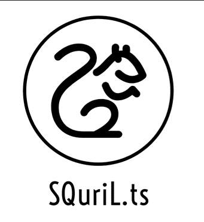

<!--
*** This ReadMe document was insipred by the ReadMe template from
*** https://github.com/othneildrew/Best-README-Template
-->

<!-- SQuriL -->
<div id='top' align='center'>

</br>
<!-- PROJECT SHIELDS -->

[![Contributors][contributors-shield]][contributors-url]
[![Stargazers][stars-shield]][stars-url]
[![Forks][forks-shield]][forks-url]

</div>

<!-- TABLE OF CONTENTS -->

<details open='open'>
  <summary>Table of Contents</summary>
  <ol>
      <li><a href='#about-squirl'>About SQuriL</a></li>
      <li><a href='#background'>Background</a></li>
      <li><a href='#getting-started'>Getting Started</a></li>
      <li><a href='#meet-squirl'>Meet SQuriL</a></li>
          <ul>
            <li><a href='#link-your-database'>Link Your Database</a></li>
            <li><a href='#generate-your-graphql-schema'>Generate Your GraphQL Schema</a></li>
            <li><a href='#save-your-schema'>Save Your Schema</a></li>
            <li><a href='#copy-or-export-your-code'>Copy Or Export Your Code</a></li>
          </ul>
      <li><a href='#for-developers'>For Developers</a></li>
          <ul>
            <li><a href='#built-with'>Built With</a></li>
            <li><a href='#project-setup'>Project Setup</a></li>
          </ul>
      <li><a href='#contributors'>Contributors</a></li>
      <li><a href='#license'>License</a></li>
  </ol>
</details>

</br>

<!-- ABOUT -->

## About SQuriL.ts

<!-- BACKGROUND -->

## Background

<!-- Meet SQuriL -->

## Meet SQuriL

### Link Your Database

### Generate Your GraphQL Schema

### Save Your Schema

### Copy or Export Your Code

<!-- For Developers -->

## For Developers 

### Built With

SQuriL was built using the following frameworks and libraries:

- [React](https://reactjs.org/)
- [GraphQL](https://graphql.org/)
- [Node.js](https://nodejs.org/en/)
- [Express](https://expressjs.com/)
- [Material-UI](https://mui.com/)
- [PostgreSQL](https://postgresql.org/)
- [CodeMirror](https://codemirror.net/)
- [Typescript](https://www.typescriptlang.org/)
- [React Animations](https://formidable.com/open-source/react-animations/#:~:text=A%20collection%20of%20animations%20that,css.)
- [Jest](https://jestjs.io/)
- [React Testing Library](https://testing-library.com/docs/react-testing-library/intro/)

<p align="right">(<a href="#top">back to top</a>)</p>

<!-- PROJECT SETUP -->

### Project Setup

Required software for setting up this application:

- [Node.js](https://nodejs.org/en/)
- [NPM ](https://www.npmjs.com/)

1. Clone the repo.
   ```sh
   git clone https://github.com/oslabs-beta/SQuriL
   cd SQuriL
   ```
2. Install the package dependencies.
   ```sh
   npm install
   ```
3. The application can be run in development mode by running the following command and going to http://localhost:3000/ on your browser.

   ```sh
   npm run dev
   ```

4. Unit testing can be run by the following command:

   ```sh
   npm run test
   ```

<p align="right">(<a href="#top">back to top</a>)</p>

<!-- CONTRIBUTORS -->

## Contributors

Diana Kim [LinkedIn](https://www.linkedin.com/in/diana-r-kim-a25a36157/) | [GitHub](https://github.com/ruslanovna)

Frank Nguyen [LinkedIn](https://www.linkedin.com/in/frankknguyen/) | [GitHub](https://github.com/frankknguyen)

Mark Charles Smith [LinkedIn](https://www.linkedin.com/in/mark-charles-smith/) | [GitHub](https://github.com/markcharlessmith)

Michael Trapani [LinkedIn](https://www.linkedin.com/in/michael-a-trapani/) | [GitHub](https://github.com/michaeltraps)

<p align="right">(<a href="#top">back to top</a>)</p>

## License

This project is licensed under the MIT License - see the [LICENSE.md](https://github.com/oslabs-beta/SQuriL/blob/main/LICENSE) file for details.

[contributors-shield]: https://img.shields.io/github/contributors/oslabs-beta/SQuriL.svg?style=for-the-badge
[contributors-url]: https://github.com/oslabs-beta/SQuriL/graphs/contributors
[stars-shield]: https://img.shields.io/github/stars/oslabs-beta/SQuriL.svg?style=for-the-badge
[stars-url]: https://github.com/oslabs-beta/SQuriL/stargazers
[forks-shield]: https://img.shields.io/github/forks/oslabs-beta/SQuriL.svg?style=for-the-badge
[forks-url]: https://github.com/oslabs-beta/SQuriL/network/members
