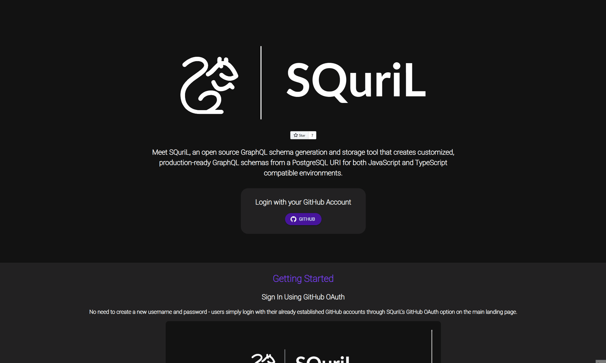
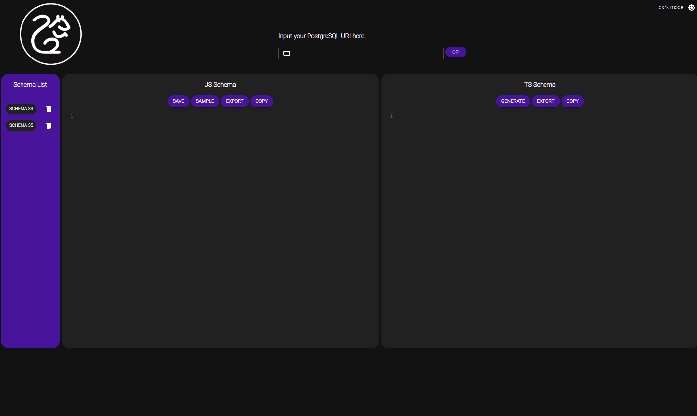
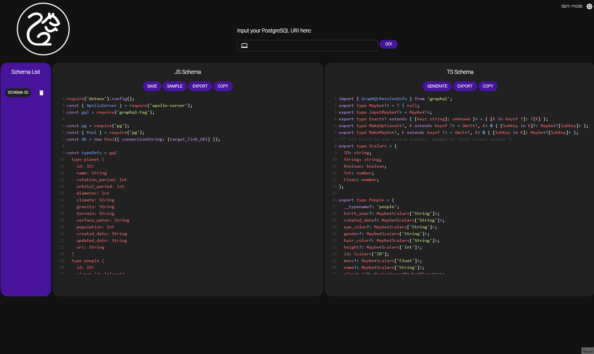

<!--
*** This ReadMe document was insipred by the ReadMe template from
*** https://github.com/othneildrew/Best-README-Template
-->

<!-- SQuriL -->
<div id='top' align='center'>

</br>
<!-- PROJECT SHIELDS -->

[![Contributors][contributors-shield]][contributors-url]
[![Stargazers][stars-shield]][stars-url]
[![Forks][forks-shield]][forks-url]

</div>

<!-- TABLE OF CONTENTS -->

<details open='open'>
  <summary>Table of Contents</summary>
  <ol>
      <li><a href='#background'>Background</a></li>
      <li><a href='#meet-squril'>About SQuriL</a></li>
      <li><a href='#getting-started'>Getting Started</a></li>
          <ul>
            <li><a href='#sign-in-using-github-oauth'>Sign In Using GitHub OAuth</a></li>
            <li><a href='#link-your-database-and-generate-your-graphql-schema'>Link Your Database</a></li>
            <li><a href='#generate-your-graphql-schema'>Generate Your GraphQL Schema</a></li>
            <li><a href='#save-your-schema'>Save Your Schema</a></li>
            <li><a href='#export-your-code'>Export Your Code</a></li>
          </ul>
      <li><a href='#for-developers'>For Developers</a></li>
          <ul>
            <li><a href='#built-with'>Built With</a></li>
            <li><a href='#project-setup'>Project Setup</a></li>
          </ul>
      <li><a href='#contributors'>Contributors</a></li>
      <li><a href='#license'>License</a></li>
  </ol>
</details>

</br>

<!-- BACKGROUND -->

## Background

[GraphQL](https://graphql.org/) is a query language and server-side runtime for application programming interfaces (APIs) that prioritizes giving users the exact data they request and nothing more. GraphQL provides a complete and understandable description of the data in a client's API, making it easier to evolve APIs over time and enables powerful developer tools.

The barrier of entry for GraphQL can be daunting - making the switch to GraphQL can be labor intensive and time consuming. On top of that, there aren't many options for both generating usable GraphQL schema for both Node.js and TypeScript environments and also storing them for future use and reference.

<p align="right">(<a href="#top">back to top</a>)</p>

<!-- MEET SQURIL -->

## Meet SQuriL

Meet [SQuriL](http://www.squril.io), an open source GraphQL schema generation and storage tool that creates customized, production-ready GraphQL schemas from a PostgreSQL URI for both Node.js and TypeScript compatible environments. Simply log in with your GitHub account and start generating and saving your GraphQL schemas today!

Accelerated by <a href="https://github.com/oslabs-beta/" >OS Labs</a>.

<p align="right">(<a href="#top">back to top</a>)</p>

<!-- GETTING STARTED -->

## Getting Started

### Sign In Using GitHub OAuth

No need to create a new username and password - users simply login with their already established GitHub accounts through SQuriL's GitHub OAuth option on the main landing page.

<div  align="center">

</div>

### Link Your Database and Generate Your GraphQL Schema

Simply copy and paste your PostgreSQL URI into the address bar at the top of the application dashboard page and hit -Go- Within seconds, both your Node.js and TypeScript compatible GraphQL schema code will be populated within the application's code windows.

<div  align="center">

</div>

### Save Your Schema

Once generated, both Node.js and TypeScript schemas can be saved by users for future database querying needs.

<div  align="center">

</div>

### Export Your Code

With a simple click, users can export their schema code to .js and .ts files for local storage.

<div  align="center">

</div>

<p align="right">(<a href="#top">back to top</a>)</p>

<!-- For Developers -->

## For Developers

### Built With

SQuriL was built using the following frameworks and libraries:

- [React](https://reactjs.org/)
- [GraphQL](https://graphql.org/)
- [Node.js](https://nodejs.org/en/)
- [Express](https://expressjs.com/)
- [Material-UI](https://mui.com/)
- [PostgreSQL](https://postgresql.org/)
- [Apollo](https://www.apollographql.com/)
- [CodeMirror](https://codemirror.net/)
- [GraphQL Code Generator](https://www.graphql-code-generator.com/)
- [Typescript](https://www.typescriptlang.org/)
- [React Animations](https://formidable.com/open-source/react-animations/#:~:text=A%20collection%20of%20animations%20that,css.)
- [Jest](https://jestjs.io/)
- [React Testing Library](https://testing-library.com/docs/react-testing-library/intro/)

<!-- PROJECT SETUP -->

### Project Setup

Required software for setting up this application:

- [Node.js](https://nodejs.org/en/)
- [NPM](https://www.npmjs.com/)

1. Clone the repo.
   ```sh
   git clone https://github.com/oslabs-beta/SQuriL
   cd SQuriL
   ```
2. Install the package dependencies.
   ```sh
   npm install
   ```
3. The application can be run in development mode by running the following command and going to http://localhost:8080/ on your browser.

   ```sh
   npm run dev
   ```

4. Unit testing can be run by the following command:

   ```sh
   npm run test
   ```

<p align="right">(<a href="#top">back to top</a>)</p>

<!-- CONTRIBUTORS -->

## Contributors

Diana R Kim [LinkedIn](https://www.linkedin.com/in/diana-r-kim-a25a36157/) | [GitHub](https://github.com/ruslanovna)

Frank Nguyen [LinkedIn](https://www.linkedin.com/in/frankknguyen/) | [GitHub](https://github.com/frankknguyen)

Mark Charles Smith [LinkedIn](https://www.linkedin.com/in/mark-charles-smith/) | [GitHub](https://github.com/markcharlessmith)

Michael Trapani [LinkedIn](https://www.linkedin.com/in/michael-a-trapani/) | [GitHub](https://github.com/michaeltraps)

<p align="right">(<a href="#top">back to top</a>)</p>

## License

This project is licensed under the MIT License - see the [LICENSE.md](https://github.com/oslabs-beta/SQuriL/blob/main/LICENSE) file for details.

<p align="right">(<a href="#top">back to top</a>)</p>

[contributors-shield]: https://img.shields.io/github/contributors/oslabs-beta/SQuriL.svg?style=for-the-badge
[contributors-url]: https://github.com/oslabs-beta/SQuriL/graphs/contributors
[stars-shield]: https://img.shields.io/github/stars/oslabs-beta/SQuriL.svg?style=for-the-badge
[stars-url]: https://github.com/oslabs-beta/SQuriL/stargazers
[forks-shield]: https://img.shields.io/github/forks/oslabs-beta/SQuriL.svg?style=for-the-badge
[forks-url]: https://github.com/oslabs-beta/SQuriL/network/members
